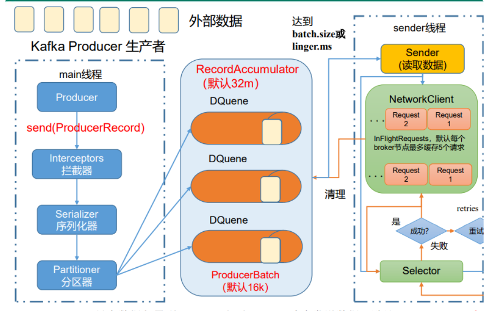

### 生产者提高吞吐量

通过提高吞吐量达到<font color = 'red'>低延迟</font>的效果


<font color = 'red'>**Batch.size 与 linger.ms 配合使用，根据生成数据的大小指定。**</font >

<font color = 'red'>**RecordAccumlator：在异步发送并且分区很多的情况下，32M的数据量容易被满足，进程交互加大，可以适当提高到64M。**</font >

代码配置如下：

```java
package com.luojia.kafka.product;

import org.apache.kafka.clients.producer.KafkaProducer;
import org.apache.kafka.clients.producer.ProducerConfig;
import org.apache.kafka.clients.producer.ProducerRecord;
import org.apache.kafka.common.serialization.StringSerializer;

import java.util.Properties;

/**
 * 消息压缩和缓冲区大小配置
 */
public class CustomProducerParameters {

    public static void main(String[] args) {
        // 配置属性类
        Properties properties = new Properties();
        properties.put(ProducerConfig.BOOTSTRAP_SERVERS_CONFIG, "127.0.0.1:9092");
        properties.put(ProducerConfig.KEY_SERIALIZER_CLASS_CONFIG, StringSerializer.class.getName());
        properties.put(ProducerConfig.VALUE_SERIALIZER_CLASS_CONFIG, StringSerializer.class.getName());

        // 缓存区大小，这里配置32M(也是默认值)
        properties.put(ProducerConfig.BUFFER_MEMORY_CONFIG, 33554432);
        // 批次大小，配置16K(也是默认值)
        properties.put(ProducerConfig.BATCH_SIZE_CONFIG, 16384);
        // 缓冲区消息等待时长，设置为1ms(0ms是默认值)
        properties.put(ProducerConfig.LINGER_MS_CONFIG, 1);
        // compression.type:消息压缩，默认为none，可配置值gzip、snappy、lz4、zstd
        properties.put(ProducerConfig.COMPRESSION_TYPE_CONFIG, "snappy");

        // 1. 创建 Kafka 生产者对象
        KafkaProducer<String, String> producer = new KafkaProducer<>(properties);
        // 2.发送 Kafka 消息
        for (int i = 0; i < 5; i++) {
            producer.send(new ProducerRecord<>("first", "kafka first compression msg : " + i));
        }

        // 3.关闭资源
        producer.close();
    }
}
```

### 消息累加器**（RecordAccumulator）**



为了提高生产者的吞吐量，我们通过累加器将多条消息合并成一批统一发送。在broker中将消息批量存入。减少多次的网络IO。

 消息累加器默认32m，如果生产者的发送速率大于sender发送的速率，消息就会堆满累加器。生产者就会阻塞，或者报错，报错取决于阻塞时间的配置。

 累加器的存储形式为 `ConcurrentMap<TopicPartition, Deque<ProducerBatch>>`，可以看出来就是一个分区对应一个双端队列，队列中存储的是 `ProducerBatch` 一般大小是16k根据batch.size配置，新的消息会append到 `ProducerBatch` 中，满16k就会创建新的 `ProducerBatch`，并且触发sender线程进行发送。

 如果消息量非常大，生成了大量的 `ProducerBatch`，在发送后，又需要JVM通过GC回收这些 `ProducerBatch` 就变得非常影响性能，所以kafka通过 `BufferPool` 作为内存池来管理 `ProducerBatch` 的创建和回收，需要申请一个新的 `ProducerBatch` 空间时，调用 `free.allocate(size, maxTimeToBlock)` 在内存池申请空间。

如果单条消息大于16k，那么就不会复用内存池了，会生成一个更大的 `ProducerBatch` 专门存放大消息，发送完后GC回收该内存空间。

> 为了进一步减小网络中消息传输的带宽。我们也可以通过**消息压缩**的方式，在生产端将消息追加进`ProducerBatch`就对每一条消息进行压缩了。常用的有Gzip、Snappy、Lz4 和 Zstd，这是时间换空间的手段。压缩的消息会在消费端进行解压。

### 消息发送线程（Sender）
 消息保存在内存后，Sender线程就会把符合条件的消息按照批次进行发送。除了发送消息，元数据的加载也是通过Sender线程来处理的。

 Sender线程发送消息以及接收消息，都是基于java NIO的Selector。通过Selector把消息发出去，并通过Selector接收消息。

 Sender线程默认容纳5个未确认的消息，消息发送失败后会进行重试。


