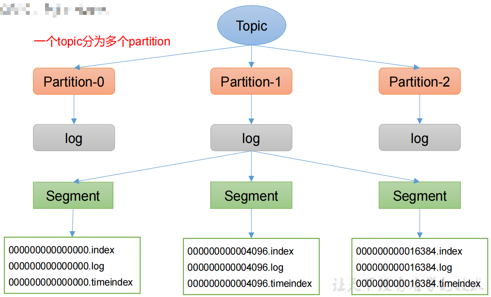
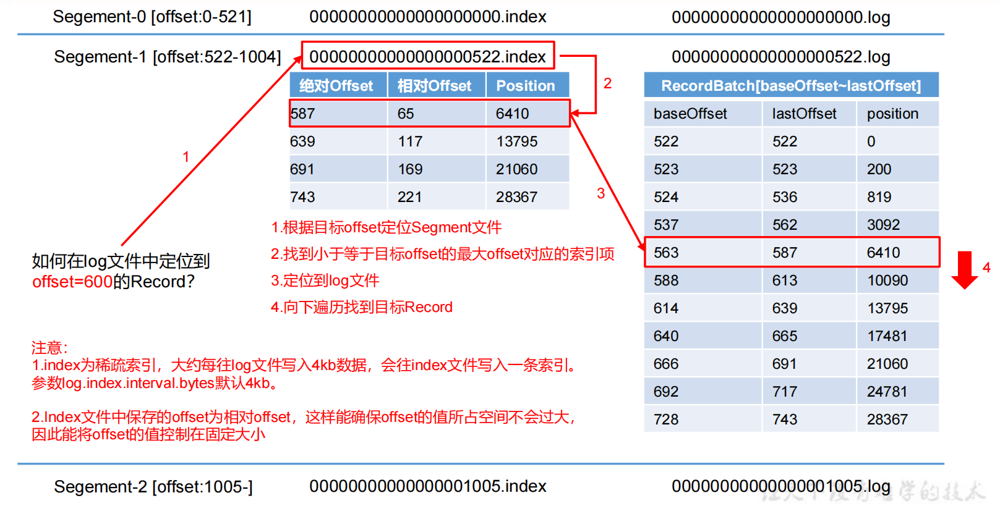

### 文件存储

#### 存储结构

在Kafka中主题（Topic）是一个逻辑上的概念，分区（partition）是物理上的存在的。<font color = 'red'>每个partition对应一个log文件</font>，该log文件中存储的就是Producer生产的数据。<font color = 'red'>Producer生产的数据会被不断追加到该log文件末端。</font>为防止log文件过大导致数据定位效率低下，<font color = 'red'>Kafka采用了分片和索引机制</font>，将每个partition分为多个segment，每个segment默认1G（` log.segment.bytes` ）， 每个segment包括.index文件、.log文件和**.timeindex**等文件。这些文件位于文件夹下，该文件命名规则为：topic名称+分区号。



如果我们直接通过cat 等命令查看，会发现里面其实都是乱码，根本看不出来是什么东西。

```shell
kafka-run-class.sh kafka.tools.DumpLogSegments --files ./00000000000000000000.index
 
kafka-run-class.sh kafka.tools.DumpLogSegments --files ./00000000000000000000.log
```


当log文件写入4k（这里可以通过 `log.index.interval.bytes` 设置）数据，就会写入一条索引信息到index文件中，这样的index索引文件就是一个**稀疏索引**，它并不会每条日志都建立索引信息。

当Kafka查询一条offset对应实际消息时，可以通过index进行二分查找，获取最近的低位offset，然后从低位offset对应的position开始，从实际的log文件中开始往后查找对应的消息。



> 上图实例中，在Kafka中index文件并没有绝对offset这条数据，这里只是为了方便计算和理解人为加上的，index文件只有相对offset的值，绝对 offset = 索引文件的值+相对offset。如果现在需要找offse=600的数据，因为它在绝对offse587和绝对offs639之间，所以它会在绝对offse587这里拿到对应的position。同理，将position拿到log文件中找数据

`时间戳索引文件` ，它的作用是可以查询某一个时间段内的消息，它的数据结构是：时间戳（8byte）+ 相对offset（4byte），如果要使用这个索引文件，先要通过时间范围找到对应的offset，然后再去找对应的index文件找到position信息，最后在遍历log文件，这个过程也是需要用到index索引文件的。


