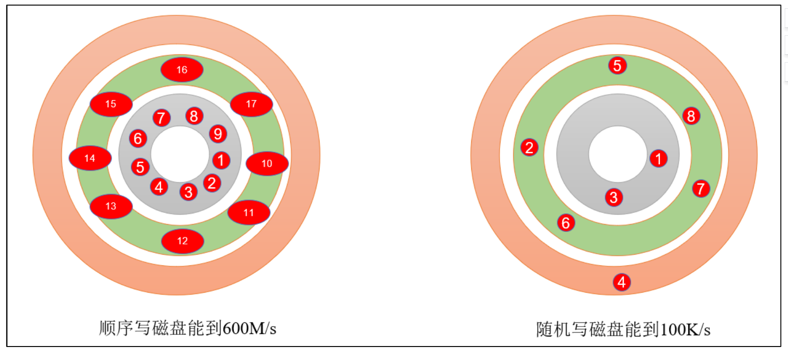

### 文件存储

#### 存储结构

在Kafka中主题（Topic）是一个逻辑上的概念，分区（partition）是物理上的存在的。<font color = 'red'>每个partition对应一个log文件</font>，该log文件中存储的就是Producer生产的数据。<font color = 'red'>Producer生产的数据会被不断追加到该log文件末端。</font>为防止log文件过大导致数据定位效率低下，<font color = 'red'>Kafka采用了分片和索引机制</font>，将每个partition分为多个segment，每个segment默认1G（` log.segment.bytes` ）， 每个segment包括.index文件、.log文件和**.timeindex**等文件。这些文件位于文件夹下，该文件命名规则为：topic名称+分区号。


如果我们直接通过cat 等命令查看，会发现里面其实都是乱码，根本看不出来是什么东西。

```shell
kafka-run-class.sh kafka.tools.DumpLogSegments --files ./00000000000000000000.index
 
kafka-run-class.sh kafka.tools.DumpLogSegments --files ./00000000000000000000.log
```


当log文件写入4k（这里可以通过 `log.index.interval.bytes` 设置）数据，就会写入一条索引信息到index文件中，这样的index索引文件就是一个**稀疏索引**，它并不会每条日志都建立索引信息。

当Kafka查询一条offset对应实际消息时，可以通过index进行二分查找，获取最近的低位offset，然后从低位offset对应的position开始，从实际的log文件中开始往后查找对应的消息。


> 上图实例中，在Kafka中index文件并没有绝对offset这条数据，这里只是为了方便计算和理解人为加上的，index文件只有相对offset的值，绝对 offset = 索引文件的值+相对offset。如果现在需要找offse=600的数据，因为它在绝对offse587和绝对offs639之间，所以它会在绝对offse587这里拿到对应的position。同理，将position拿到log文件中找数据

`时间戳索引文件` ，它的作用是可以查询某一个时间段内的消息，它的数据结构是：时间戳（8byte）+ 相对offset（4byte），如果要使用这个索引文件，先要通过时间范围找到对应的offset，然后再去找对应的index文件找到position信息，最后在遍历log文件，这个过程也是需要用到index索引文件的。


#### 文件清理策略

Kafka将消息存储在磁盘中，为了控制磁盘占用空间的不断增加就需要对消息做一定的清理操作。Kafka 中每一个分区副本都对应一个Log，而Log又可以分为多个日志分段，这样也便于日志的清理操作。Kafka提供了两种日志清理策略。

- 日志删除(delete) :按照一定的保留策略直接删除不符合条件的日志分段。
- 日志压缩(compact) :针对每个消息的key进行整合，对于有相同key的不同value值，只保留最后一个版本。

我们可以通过修改broker端参数 `log.cleanup.policy` 来进行配置

##### 1.日志删除
kafka中默认的日志保存时间为7天，可以通过调整如下参数修改保存时间。

`log.retention.hours`：最低优先级小时，默认7天

`log.retention.minutes`：分钟

`log.retention.ms`：最高优先级毫秒

`log.retention.check.interval.ms`：负责设置检查周期，默认5分钟

`file.delete.delay.ms`：延迟执行删除时间

`log.retention.bytes`：当设置为-1时表示运行保留日志最大值（相当于关闭）；当设置为1G时，表示日志文件最大值

具体的保留日志策略有三种：

###### 基于时间策略

日志删除任务会周期检查当前日志文件中是否有保留时间超过设定的阈值来寻找可删除的日志段文件集合；这里需要注意log.retention参数的优先级：`log.retention.ms > log.retention.minutes > log.retention.hours`，默认只会配置log.retention.hours参数，值为168即为7天。

 删除过期的日志段文件，并不是简单的根据日志段文件的修改时间计算，而是要根据该<font color = 'red'>日志段中最大的时间戳来计算的</font>，首先要查询该日志分段所对应的时间戳索引文件，查找该时间戳索引文件的最后一条索引数据，如果时间戳大于0就取值，否则才会使用最近修改时间。

在删除的时候先从Log对象所维护的日志段的跳跃表中移除要删除的日志段，用来确保已经没有线程来读取这些日志段；接着将日志段所对应的所有文件，包括索引文件都添加上\**.deleted的后缀；最后交给一个以delete-file命名的延迟任务来删除这些以.deleted为后缀的文件，默认是1分钟执行一次，可以通过`file.delete.delay.ms`来配置。

###### 基于日志大小策略

日志删除任务会周期性检查当前日志大小是否超过设定的阈值（log.retention.bytes，默认是-1，表示无穷大），就从第一个日志分段中寻找可删除的日志段文件集合。如果超过阈值，

**基于日志起始偏移量**

该策略判断依据是日志段的下一个日志段的起始偏移量 baseOffset是否小于等于 logStartOffset，如果是，则可以删除此日志分段。这里说一下logStartOffset，一般情况下，日志文件的起始偏移量 logStartOffset等于第一个日志分段的 baseOffset，但这并不是绝对的，logStartOffset的值可以通过 DeleteRecordsRequest请求、使用 kafka-delete-records.sh 脚本、日志的清理和截断等操作进行修改。

##### 2.日志压缩

日志压缩对于有相同key的不同value值，只保留最后一个版本。如果应用只关心 key对应的最新 value值，则可以开启 Kafka相应的日志清理功能，Kafka会定期将相同 key的消息进行合并，只保留最新的 value值

- log.cleanup.policy = compact 所有数据启用压缩策略


<font color = 'red'>这种策略只适合特殊场景，比如消息的key是用户ID，value是用户的资料，通过这种压缩策略，整个消息集里就保存了所有用户最新的资料。</font>

#### Kafka高效读数

kafka之所以可以快速读写的原因如下：

- kafka是分布式集群，采用分区方式，并行操作
- 读取数据采用稀疏索引，可以快速定位消费数据
- 顺序写磁盘
- 页缓冲和零拷贝

##### 顺序写磁盘

Kafka 的 producer 生产数据，要写入到 log 文件中，写的过程是一直追加到文件末端，为顺序写。官网有数据表明，同样的磁盘，顺序写能到 600M/s，而随机写只有 100K/s。这与磁盘的机械机构有关，顺序写之所以快，是因为其省去了大量磁头寻址的时间。



##### 页缓存与零拷贝

kafka高效读写的原因很大一部分取决于**页缓存**和**零拷贝**


